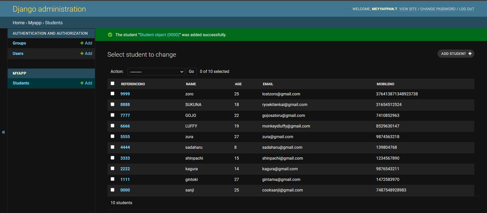

# Django ORM Web Application

## AIM
To develop a Django application to store and retrieve data from a database using Object Relational Mapping(ORM).

## Entity Relationship Diagram

Include your ER diagram here

## DESIGN STEPS

### STEP 1:
Clone the repository django-orm-app.
### STEP 2:
Open data project and open settings.py and make the required edits. 
### STEP 3:
Now run code python manage.py startapp myapp and add myapp in settings.py in line 40
### STEP 4:
Now run code python manage.py makemigrations and then python manage.py migrate to migrate the changes

### STEP 5:
Now we run the program using the code python manage.py runserver 0:8000 

### STEP 6:
Open the server and add 10 student users

## PROGRAM

Include your code here

## OUTPUT

## RESULT
We have succesfully created 10 student users as a superuser
